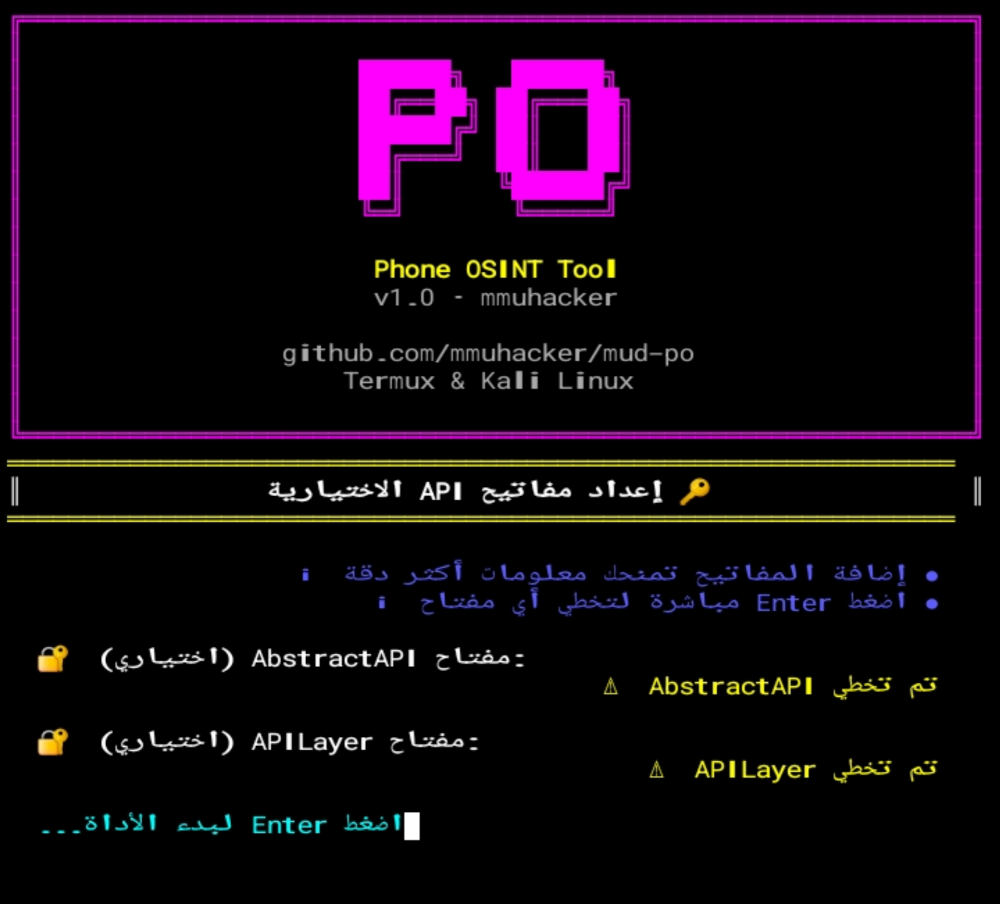
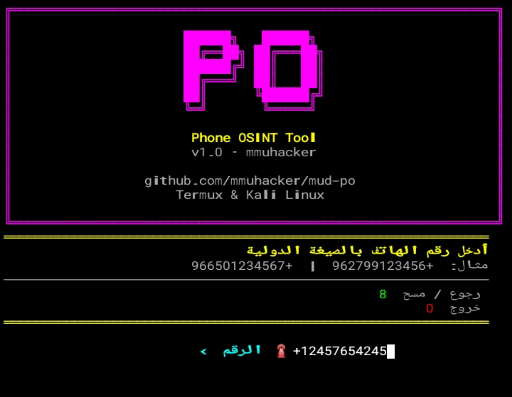
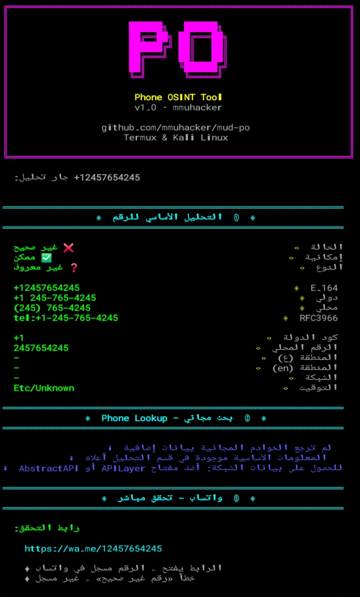
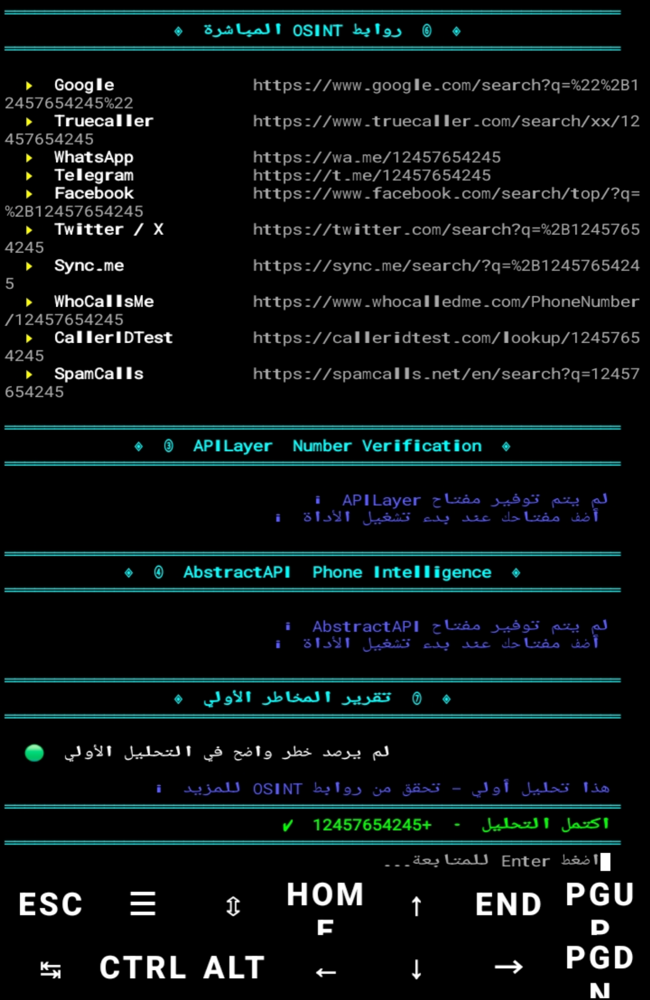

<div align="center">

# 📱 Phone OSINT Tool

# 📱 أداة جمع معلومات رقم الهاتف

---

<div align="center">


</div>

---

[](https://github.com/mmuhacker)<br>
<br>
<br>
<br>
<br>
<br>
<br>

---

**📚 المحتويات**

</div>

- [نظرة عامة](#-نظرة-عامة)
- [المميزات](#-المميزات)
- [المتطلبات](#-المتطلبات)
- [التثبيت](#-التثبيت)
  - [التثبيت على Termux](https://github.com/mmuhacker/mud_po/blob/main/README.md#%D8%B9%D9%84%D9%89-termux-android)
  - [التثبيت على Kali Linux](https://github.com/mmuhacker/mud_po/blob/main/README.md#%D8%B9%D9%84%D9%89-kali-linux)
- [اعداد المفاتيح](#مفاتيح)
- [طريقة الاستخدام](#طريقة-الإستخدام)
- [أزرار التحكم](#أزرار)
- [أمثلة على النتائج](#نتائج)
- [هيكل الملفات](#-هيكل-الملفات)
- [ملف requirements.txt](#ملفات)
- [المساهمة](#مساهمة)
- [المطور](#المطور)
- [الرخصة](#رخصة)

---

<div align="center">
     
## 📋 نظرة عامة

</div>

أداة سطر أوامر مكتوبة بـ Python تُستخدم لجمع المعلومات المفتوحة المصدر (OSINT) حول أرقام الهاتف. تعمل بشكل كامل على **Termux (Android)** و**Kali Linux** مع واجهة مستخدم عربية بالكامل.

> ⚠️ **تنبيه قانوني:** هذه الأداة مخصصة للأغراض التعليمية والبحث الأمني الأخلاقي فقط. استخدمها بمسؤولية ووفقاً لقوانين بلدك.

---

<div align="center">


## ✨ المميزات

| الميزة | الوصف |
|--------|-------|
| 🔑 **مفاتيح API**|يمكن إستخدام المفاتيح للحصول على معلومات أكثر دقة|
| 🔍 **تحليل أساسي كامل** | نوع الرقم، صحته، الشبكة، المنطقة الزمنية، صيغ E.164/INTL/RFC3966 |
| 🌍 **معلومات الدولة والشبكة** | اسم المشغل، رمز الدولة، المنطقة الجغرافية بالعربي والإنجليزي |
| 🔗 **12+ رابط OSINT مباشر** | Truecaller، Google، Telegram، Facebook، Twitter، Sync.me، WhoCallsMe، SpamCalls وغيرها |
| 💬 **تحقق واتساب** | رابط مباشر للتحقق من تسجيل الرقم في واتساب |
| 🌐 **NumLookup API** | استعلام مجاني تلقائي عن معلومات الرقم |
| 🔑 **APILayer + AbstractAPI** | دعم APIs إضافية (تتطلب مفتاح مجاني) |
| ⚠️ **تقرير المخاطر** | كشف أرقام VoIP، الأرقام المجانية، مزودي الخدمات المجهولين |
| 🇸🇦 **واجهة عربية كاملة** | جميع النصوص والرسائل بالعربية |
| 🤖 **تثبيت تلقائي** | تكتشف الأداة المكتبات الناقصة وتثبتها تلقائياً |

---

## 📦 المتطلبات


## المكتبات (تُثبَّت تلقائياً)

</div>

```
phonenumbers
requests
```

<div align="center">
  
## أدوات النظام

| البيئة | الأمر |
|--------|-------|
| Termux | `pkg install python` |
| Kali Linux | `sudo apt install python3 python3-pip` |

</div>

---

<div align="center" id="التثبيت">
     
## 🚀 التثبيت

</div>

---

<div align="center" id="تيرموكس">

## على Termux (Android)

</div>

**1. تثبيت Python إذا لم يكن مثبتاً**

```bash
pkg update && pkg install python git
```

**2. استنساخ المستودع**
```bash
git clone https://github.com/mmuhacker/mud-po
cd mud-po
```

**3. تشغيل الأداة (ستثبت المكتبات تلقائياً)**
```bash
python mud_po.py
```

---

<div align="center" id="لينكس">

## على Kali Linux

</div>


**1. استنساخ المستودع**
```bash
git clone https://github.com/mmuhacker/mud-po
cd mud-po
```

**2. تثبيت المكتبات**
```bash
pip install -r requirements.txt
```

**3. تشغيل الأداة**
```bash
python3 mud_po.py
```

## تشغيل مباشر (بدون git)

**Termux**
```bash
curl -LO https://raw.githubusercontent.com/mmuhacker/mud-po/main/mud_po.py
python mud_po.py
```
---

**Kali Linux**
```bash
wget https://raw.githubusercontent.com/mmuhacker/mud-po/main/mud_po.py
python3 mud_po.py
```

---

<div align="center" id="مفاتيح">

## ⚙️ إعداد المفاتيح (اختياري)

</div>

**لاستخدام APILayer و AbstractAPI (مجاناً حتى 100 طلب/شهر):**
⚡️**هذه اامفاتيح تعطيك معلومات أكثر عن الأرقام وبدقة عالية**
***يمكن إستخدام الأداة بدون مفاتيح***

**احصل على مفتاح مجاني من https://apilayer.com**

**احصل على مفتاح مجاني من https://app.abstractapi.com**

**إحفظ المفاتيح في مكان آمن**

<div align="center">


📷 **الواجهة الرئيسية – إضافة مفاتيح API**



<i style="color: var(--color-fg-default);">الشكل 1: إضافة مفاتيح API</i>

</div>

---

<div align="center" id="طريقة-الإستخدام">
  
## 🎯 طريقة الإستخدام

**تشغيل الأداة**

</div>

```bash
python3 mud_po.py
```


<div align="center">

**الاستخدام خطوة بخطوة**

</div>

1. *شغّل الأداة*
2. *أدخل رقم الهاتف بالصيغة الدولية:*
       مثال: +962799123456   (الأردن)
           +966501234567   (السعودية)
           +201001234567   (مصر)

<div align="center">

📷 **ادخال رقم الهاتف**



<i style="color: var(--color-fg-default);">الشكل 2: ادخال الرقم</i>

</div>

3. *اضغط Enter لبدء الفحص*
4. *انتظر نتائج التحليل التلقائي الكامل*
5. *استخدم روابط OSINT للبحث الإضافي*
6. *اضغط Enter للبحث عن رقم آخر*
7. *اكتب  0  للخروج*


---

<div align="center" id="أزرار">

## أزرار التحكم

| المفتاح | الوظيفة |
|---------|---------|
| `0` | خروج من الأداة |
| `8` | رجوع / إلغاء |
| `Enter` | تأكيد / متابعة |

</div>

---

<div align="center" id="نتائج">

## 📊 أمثلة على النتائج


📷 **صور النتائج**




<i style="color: var(--color-fg-default);">الشكل 4: النتائج</i>

</div>


---

<div align="center" id="ملفات">

## 🗂️ هيكل الملفات

```
mud-po/
└── img                # صور الأداة
└── LICENSE            # رخصة MIT
└── requirements.txt   # رخصة MIT
├── mud_po.py          # ملف الأداة
├── README.md          # هذا الملف
└── LICENSE            # ترخيص خاص
```

</div

---

<div align="center" id="txt">

## 📝 ملف requirements.txt

```
phonenumbers>=8.13.0
requests>=2.28.0
```

---

<div align="center" id="مساهمة">
  
## 🤝 المساهمة

</div>

المساهمات مرحب بها! يمكنك:
- فتح Issue للإبلاغ عن خطأ
- تقديم Pull Request لإضافة ميزة
- اقتراح تحسينات عبر Issues

---

<div align="center" id="المطور">

## 👨‍💻 المطور

**Muhannad Daher**

[](https://github.com/mmuhacker)

</div>

---

<div align="center" id="رخصة"
  >
## 📄 الرخصة
**رخصة الاستخدام والنشر مع منع التعديل** – يُسمح باستخدام الأداة ونشرها بحرية، لكن يُمنع تعديل الكود أو هندسته عكسياً. راجع [الترخيص](#https://github.com/mmuhacker/mud-po/blob/main/LICENSE.md) للتفاصيل الكاملة.

---
</div>

- أداة فحص المتاحات المتطورة (32) منصة
- البيئة: Termux (Android) / Kali Linux
- الإصدار: v1.0


---
<div align="center">

***Madarik Tools — صُنع بالعربية***

⭐ **إذا أعجبتك الأداة، لا تنسَ النجمة!** ⭐
</div>


</div>
